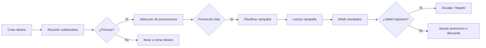
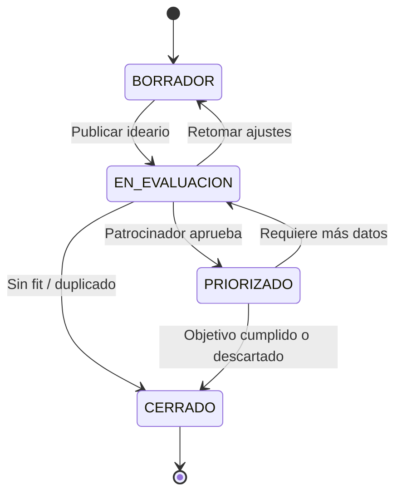
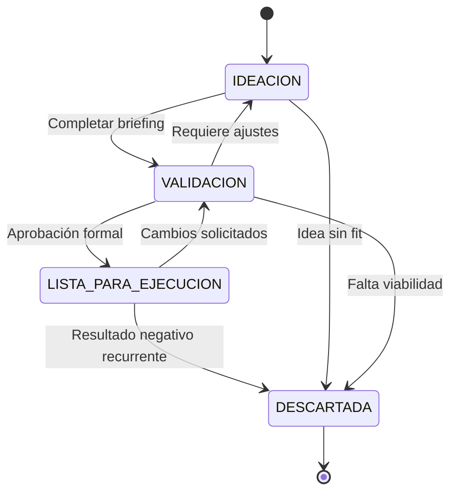

<!-- Documento: Flujos de usuario Ideario / Matriz de Necesidades -->

# Flujos de usuario y estados

Este documento describe los flujos principales dentro del módulo **Ideario**, los roles involucrados y la lógica de transición entre estados para idearios y promociones.

## Roles involucrados

- **Gerente / Patrocinador**: valida la necesidad, prioriza idearios y aprueba promociones para ejecución.
- **Líder de marketing**: coordina la ideación, aplica criterios de priorización y gestiona campañas derivadas.
- **Especialista / Trafficker**: implementa campañas y reporta resultados.
- **Stakeholders invitados**: aportan comentarios y adjuntan investigación.

## Flujo general Ideario → Promoción → Campaña

## Ciclo de vida de Ideario

Estados:

1. `BORRADOR`
   - Creación por parte del gerente.
   - Puede editarse libremente y recibir comentarios preliminares.
2. `EN_EVALUACION`
   - Al compartir con el equipo para ideación.
   - Se espera feedback, adjuntos y definición de KPIs.
3. `PRIORIZADO`
   - Tras evaluar impacto/urgencia.
   - Requiere al menos una promoción en estado `LISTA_PARA_EJECUCION`.
4. `CERRADO`
   - Conclusión: éxito, pivot o descarte.
   - Se registran motivos y aprendizajes.

Transiciones válidas (Mermaid):

### Criterios de priorización (ICE adaptado)

- **Impacto**: contribución esperada a KPIs estratégicos (1–5).
- **Confianza**: disponibilidad de datos/insights que respaldan la idea (1–5).
- **Esfuerzo**: costo relativo para experimentar (1–5, invertido).
- **Urgencia**: alineación con horizontes definidos (peso adicional).

Se sugiere calcular una puntuación compuesta `Score = (Impacto * Confianza) / Esfuerzo`, ajustando con un factor por horizonte (`Urgente` multiplica por 1.2).

## Ciclo de vida de Promoción

Estados:

1. `IDEACION`
   - Propuesta inicial, requiere completar briefing.
2. `VALIDACION`
   - Se completan campos obligatorios, se adjuntan evidencias.
   - Debe contar con scoring ICE y feedback mínimo (>= 1 comentario del patrocinador).
3. `LISTA_PARA_EJECUCION`
   - Aprobada por patrocinador/marketing.
   - Asignada a un responsable operativo.
4. `DESCARTADA`
   - No continúa; se registra motivo (datos insuficientes, duplicado, etc.).

Transiciones:

## Flujo operativo detallado

1. **Creación de ideario**
   - Gerente ingresa necesidad, define KPIs y horizonte.
   - Sistema notifica a líderes de marketing.
2. **Sesión de ideación**
   - Marketing y stakeholders proponen promociones.
   - Se registran comentarios, adjuntos y estimaciones.
3. **Priorización**
   - Reunión quincenal: revisar score ICE, urgencia y recursos.
   - Idearios relevantes pasan a `PRIORIZADO`, otros se cierran o iteran.
4. **Preparación de campañas**
   - Promociones `LISTA_PARA_EJECUCION` se transforman en tickets de planificación.
   - Se asigna owner, presupuesto y fecha objetivo.
5. **Ejecución y retroalimentación**
   - Al cerrar una campaña, se actualiza `hipotesisValidada`.
   - Se revisa si se escalará, se iterará o se descartará la promoción.
6. **Post-mortem**
   - Idearios cerrados requieren resumen de aprendizajes.
   - Insights se comparten en dashboard y reportes.

## Puntos de control

- Idearios sin promociones en `VALIDACION` tras 7 días → alerta a líder.
- Promociones `LISTA_PARA_EJECUCION` sin campaña creada en 14 días → notificación automática.
- Campañas finalizadas sin resultados registrados → tarea pendiente para responsable.

## Integración con módulos existentes

- **Campañas**: nuevo campo `promocionId` y filtros por estado Ideario/Promoción.
- **Historial**: registrar cambios de estado como eventos.
- **Notificaciones**: disparadores para alertas descritas.

## Artefactos sugeridos

- Plantilla de brief para promociones (puede implementarse como formulario preconfigurado).
- Tablero Kanban (Ideario → Promociones → Campañas).
- Reporte mensual de conversión de ideas en campañas exitosas.

