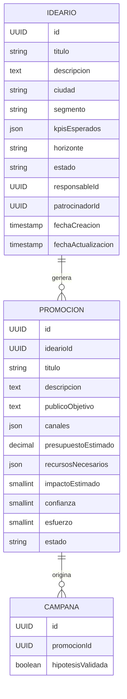

<!-- Documento: Modelo de datos Ideario / Matriz de Necesidades -->

# Modelo de datos propuesto

Este documento describe la estructura de entidades y relaciones necesarias para implementar el módulo **Ideario** en Siscoca. La meta es asegurar trazabilidad desde la necesidad inicial hasta los resultados de campañas, manteniendo coherencia con la arquitectura actual (`backend/src/main/java/com/siscoca` y `frontend/src`).

## Entidades principales

### Ideario

| Campo | Tipo sugerido | Descripción |
| --- | --- | --- |
| `id` | UUID | Identificador único. |
| `titulo` | VARCHAR(150) | Nombre corto legible (ej. “Scouts Lima”). |
| `descripcion` | TEXT | Contexto detallado de la necesidad. |
| `objetivoCorporativoId` | VARCHAR(64) | Referencia a catálogo corporativo de objetivos (si existe). |
| `ciudad` | VARCHAR(80) | Segmento geográfico objetivo. |
| `segmento` | VARCHAR(80) | Segmento de cliente opcional. |
| `kpisEsperados` | JSON | Lista de KPIs con meta (ej. `{ "leads": 500 }`). |
| `horizonte` | ENUM(`URGENTE`,`Q_ACTUAL`,`Q_SIGUIENTE`,`EXPLORATORIO`) | Prioridad temporal. |
| `estado` | ENUM(`BORRADOR`,`EN_EVALUACION`,`PRIORIZADO`,`CERRADO`) | Flujo de vida del ideario. |
| `responsableId` | UUID | Usuario que propone. |
| `patrocinadorId` | UUID | Director/Gerente que aprueba. |
| `fechaCreacion` | TIMESTAMP | Fecha de alta. |
| `fechaActualizacion` | TIMESTAMP | Última modificación. |
| `motivoCierre` | TEXT | Resultado o motivación de cierre. |

Relaciones:
- **1:N con `Promocion`** (un ideario genera múltiples ideas/promociones).
- **1:N con `ComentarioIdeario`** (historial colaborativo).
- **1:N con `DocumentoAdjunto`** (briefs, estudios, etc.).

### Promocion

| Campo | Tipo sugerido | Descripción |
| --- | --- | --- |
| `id` | UUID | Identificador único. |
| `idearioId` | UUID (FK) | Relación con el ideario padre. |
| `titulo` | VARCHAR(150) | Nombre descriptivo (ej. “Referidos scouts universidades”). |
| `descripcion` | TEXT | Hipótesis y propuesta de valor. |
| `publicoObjetivo` | TEXT | Perfil detallado (buyer persona). |
| `canales` | JSON | Lista de canales sugeridos (`["Email","Redes"]`). |
| `presupuestoEstimado` | DECIMAL(12,2) | Presupuesto para una campaña inicial. |
| `recursosNecesarios` | JSON | Recursos clave (equipos, proveedores). |
| `impactoEstimado` | SMALLINT | Puntuación 1-10. |
| `confianza` | SMALLINT | Puntuación 1-10 (basado en datos). |
| `esfuerzo` | SMALLINT | Puntuación 1-10 (recursos/tiempo). |
| `estado` | ENUM(`IDEACION`,`VALIDACION`,`LISTA_PARA_EJECUCION`,`DESCARTADA`) | Flujo de maduración. |
| `fechaCreacion` | TIMESTAMP | Alta. |
| `fechaActualizacion` | TIMESTAMP | Última modificación. |
| `motivoDescarte` | TEXT | Contexto cuando se descarta. |

Relaciones:
- **1:N con `Campana`** (una promoción puede originar varias iteraciones de campaña).
- **1:N con `ComentarioPromocion`** (feedback específico).
- **N:N con `Etiqueta`** para filtrar (ej. vertical, producto).

### Campana (extensión)

La entidad campaña ya existe. Se propone añadir campos:

| Campo | Tipo sugerido | Descripción |
| --- | --- | --- |
| `promocionId` | UUID (FK) | Traza la campaña a la promoción que la originó. |
| `hipotesisValidada` | BOOLEAN | Resultado de la experimentación. |
| `resultadoNota` | TEXT | Resumen cualitativo del desempeño. |

Con esta referencia se puede derivar el legado: `Ideario -> Promoción -> Campaña`.

### Otras entidades de soporte

- **`ComentarioIdeario` / `ComentarioPromocion`**: guardan texto, autor, fecha, tipo (pregunta, decisión).
- **`DocumentoAdjunto`**: ruta/alojamiento, tipo (PDF, enlace externo), descripción.
- **`AlertaPromocion`**: registra eventos como “sin campaña 14 días”.

## Modelo relacional sugerido

## Consideraciones para backend (Java/Spring Boot)

- Crear entidades JPA `Ideario`, `Promocion`, `ComentarioIdeario`, etc., con repositorios dedicados.
- Usar `@Enumerated(EnumType.STRING)` para estados.
- Serializar campos JSON (KPIs, canales) con `@Type(type = "jsonb")` si se usa PostgreSQL; alternativa: tablas hijas normalizadas.
- Definir DTOs ligeros para listados y detalles. Ejemplos:
  - `IdearioResumenDTO` (titulo, estado, horizonte, totalPromociones, totalCampanas).
  - `IdearioDetalleDTO` (incluye promociones y alertas).
- Endpoints REST recomendados:
  - `POST /idearios` crear.
  - `GET /idearios?estado=...` listado.
  - `GET /idearios/{id}` detalle con promociones.
  - `POST /promociones` vinculación a ideario existente.
  - `POST /promociones/{id}/score` actualizar scoring ICE/RICE.
  - `GET /promociones?estado=LISTA_PARA_EJECUCION&sinCampana=true` para alertas.

## Consideraciones para frontend (React/TypeScript)

- Definir tipos en `frontend/src/types`:
  - `Ideario`, `Promocion`, `KpiEsperado`, `Alerta`.
- Actualizar `campanaService` para incluir `promocionId`.
- Crear servicios `idearioService` y `promocionService` con llamadas REST alineadas al backend.
- Preparar stores (Zustand) para gestionar estado de idearios y promociones con filtros por estado/ciudad.

## Integridad y reglas de negocio

- No permitir `Promocion.estado = LISTA_PARA_EJECUCION` si no tiene scoring completo.
- Bloquear cierre de un ideario mientras existan promociones activas sin decisión.
- Si se cierra el ideario, todas las promociones pendientes pasan a `DESCARTADA` con motivo automático.
- Actualizar campañas existentes a `promocionId = NULL` cuando la promoción se descarte (o impedir descarte si hay campañas activas).

## Auditoría y métricas

- Registrar cambios críticos en tabla de auditoría (ya existe módulo de historial).
- Capturar métricas:
  - Tiempo desde ideario creado hasta primera campaña.
  - % de promociones que pasan a campaña.
  - KPIs esperados vs reales.

## Próximos pasos técnicos

1. Validar con stakeholders si `JSON` es aceptable o se requiere modelado normalizado.
2. Confirmar catálogos existentes (objetivos corporativos, ciudades, segmentos).
3. Ajustar migraciones SQL para crear tablas y relaciones.

